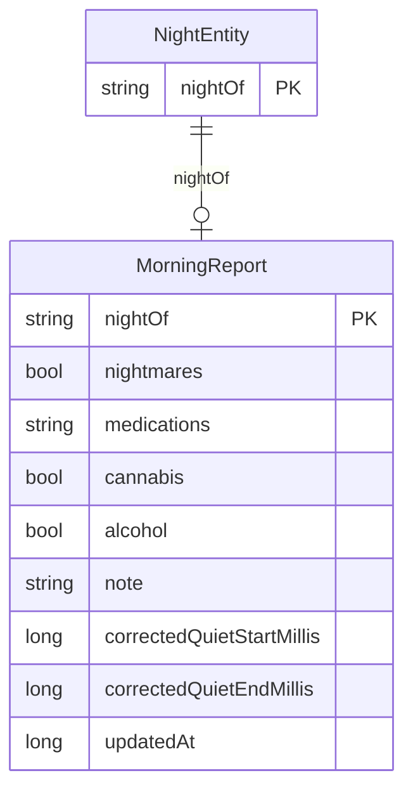

# UI flow & screen logic

The screen logic for the native SleepGuard app (on-device only). Design/visuals are intentionally
**out of scope here** — this is structure, data sources, states, and navigation. Based on the
original Base44 screens, re-grounded on the local Room data.

## Screens at a glance

Four bottom tabs (right→left, as in the app): **בית** (Home) · **לילה אחרון** (Last Night) ·
**היסטוריה** (History) · **מידע נוסף** (More info — renamed from "הגדרות", since there is no
profile/account; the tab is purely informational). Plus two **sub-screens** reached from within:
**דו"ח פעילות יומי** (Night Report) and **שאלון יומי** (Questionnaire).

```mermaid
flowchart TD
  Launch[App launch / resume] --> Perm{Usage Access granted?}
  Perm -- No --> Grant[Enable-access state]
  Perm -- Yes --> Collect[Auto-collect recent nights]
  Collect --> Has{Any saved nights?}
  Has -- No --> Empty[No-data guidance]
  Has -- Yes --> Home

  Home[בית / Home — latest summary] --> Report
  Last[לילה אחרון / Last Night] --> Report[דו\"ח פעילות יומי / Night Report]
  Hist[היסטוריה / History — list] -->|tap a night| Report
  Info[מידע נוסף / More info]
  Report -->|מילוי שאלון| Quest[שאלון יומי / Questionnaire]
```

## Two data layers (per night, joined by `nightOf`)

The original product = passive activity **+** a short morning self-report. That self-report (plus
manual time edits) is user input, not derived from screen events — so it lives in its **own** layer:

| Layer | Entity | Source | Mutable by |
| --- | --- | --- | --- |
| Analysis | `NightEntity` (exists) | screen events → analyzer | re-collection (recomputable) |
| User | `MorningReport` (**new**) | the questionnaire + "edit times" | the user |

`MorningReport` is a new Room table keyed by `nightOf` (parallel to `NightEntity`), joined for
display. Keeping it separate means re-collecting/overwriting a night's analysis never destroys the
user's self-report. Additive — does not touch the existing Room work.



## Global states (every tab must handle)

1. **No Usage Access** → "enable access" prompt (the only thing shown until granted).
2. **Granted, no nights yet** → friendly "open after a night" guidance (never an empty dashboard).
3. **Latest night in progress** (collected mid-night, `collectedAt < windowEnd`) → show the last
   *complete* night + a small note. (Logic exists: `isCompleteNight`.)
4. **Has data** → normal.

---

## 1. בית — Home

At-a-glance summary of the **latest complete night**.

- **Source:** newest `NightEntity` with `collectedAt ≥ windowEnd` (add `getLatestComplete()` or pick
  from `getAllSummaries()`).
- **Content:** date (`nightOf`); quiet window `start–end`; duration; data-availability chip
  (`confidence`); pattern chip (`restPattern`); interruptions (`awakenings.size`); pre-sleep phone use
  (`preSleepPhoneTimeMillis`). Optional link → Last Night.
- **No greeting** (no account — decided).

## 2. לילה אחרון — Last Night → Night Report (latest)

The Last Night tab opens the shared **Night Report** for the latest night. Same screen as a History
night, different source. (Decided: one reusable report screen.)

## 3. היסטוריה — History

List of saved nights; tap → Night Report for that night.

- **Source:** `getAllSummaries()` (the projection we built — no heavy events loaded).
- **Row:** duration · window `start–end` · date (`nightOf`) · status dot · pattern chip · mini bar.
  - Status dot / chip ← `restPattern` (green = רצוף/CONSOLIDATED, amber = מקוטע/FRAGMENTED) and
    `confidence` (data availability). Newest first.
- **Tap** → `getByNight(nightOf)` → Night Report.

## 4. מידע נוסף — More info (was "הגדרות")

Informational (about / data source / privacy), as in the screenshot. Renamed because there is no
profile to configure.

- **About:** "SleepGuard · גרסה X", one-line description.
- **Data source:** "Android Native Component" — reads screen on/off timings only.
- **Privacy:** the on-device bullets (no identifying data, stays on device, screen content not read).
- **Native actions (decided):** "מידע נוסף" stays purely informational. Usage Access is handled
  **contextually** in the no-permission state (not a setting). Export backup / Clear data stay
  **debug/POC** actions, out of the product UI for now.

---

## Sub-screen A — דו"ח פעילות יומי (Night Report) — SHARED

Reached from Home, Last Night, and History. Source: `getByNight(nightOf)` (full record incl. events)
joined with the night's `MorningReport`.

| Section | Source |
| --- | --- |
| Hero: owl + "דו"ח פעילות יומי" + date + back | `nightOf` |
| Chips: data availability · pattern | `confidence`, `restPattern` |
| Summary sentence | templated from `restPattern` + quiet duration |
| **Timeline** (read-only in v1): axis `windowStart → collectedAt`; quiet block(s); pre-quiet activity (estimated) | `mainRestEpisode`/`primaryRest`, events; footnote "הערכה גסה". ("ערוך זמנים" deferred — see decisions.) |
| Card: פעילות אחרונה | quiet start = `phoneDown` |
| Card: פעילות ראשונה | quiet end = `firstUseAfter…` |
| Card: חזרות לפעילות | `awakenings.size` (+ times) |
| Card: סך זמן חוסר הפעילות | quiet duration |
| Card: שימוש שעתיים לפני | `preSleepPhoneTimeMillis` |
| **יומן פעילות גולמי** (collapsible — transparency feature) | `events` (lazy); `ScreenEventType` → Hebrew labels |
| תובנת הינשוף | derived template (see wording note) |
| שאלון יומי card: status + "מילוי שאלון" | `MorningReport` presence → Questionnaire |

**Raw activity log = a transparency feature, not just debug.** The collapsible "יומן פעילות גולמי"
shows the FULL, unfiltered event stream — every **מסך נדלק** (on) / **מסך נכבה** (off) / **פתיחה**
(unlock) / **נעילה** (lock) with its timestamp. It is deliberately exhaustive: complete transparency
gives the user a sense of control and trust, and lets them interpret the night themselves. Source:
`events` (the four `ScreenEventType`s → Hebrew labels), lazy-loaded on expand.

## Sub-screen B — שאלון יומי (Questionnaire)

Per-night self-report, opened from the report's questionnaire card.

- **Fields:** סיוטים (yes/no) · תרופות (none/text) · קנאביס (yes/no) · אלכוהול (yes/no) · הערה חופשית.
- **Actions:** שמור → upsert `MorningReport` for `nightOf`; "אפשר למלא גם אחר כך" → dismiss.
- **States:** empty (new) / pre-filled (editable).

---

## Resolved decisions (locked 2026-06-27)

1. **תובנת הינשוף wording = factual template.** No soft judgments ("לילה רגוע במיוחד" → e.g. "לא זוהו
   הפרעות בשעות חוסר הפעילות"). A wording set will be proposed and reviewed against the UX-wording rules.
2. **"ערוך זמנים" = deferred to a later phase.** v1 timeline is **read-only**. The `MorningReport`
   `correctedQuiet*` fields are reserved for that later phase and are NOT built in v1.
3. **Native actions home = permission contextual; export/clear stay debug-only.** Usage Access is
   handled only in the no-permission state; "מידע נוסף" stays purely informational; Export backup /
   Clear data remain debug/POC actions, out of the product UI for now.

## Data layer (status)

- ✅ **Built (2026-06-27):** `MorningReportEntity` + `MorningReportDao` (`upsert`, `getByNight`,
  `getFilledNights`, `clearAll`) + `MorningReportRepository`. Room bumped to **v2** with an explicit
  `MIGRATION_1_2` that creates `morning_reports`. v1 fields = nightmares / medications / cannabis /
  alcohol / note / updatedAt; the `correctedQuiet*` fields are deferred with the "ערוך זמנים" feature.
- ✅ **Built:** `NightDao.getLatestComplete()` + `NightRepository.getLatestComplete()` for Home / Last Night.
- Already existed: `getAll`, `getByNight`, `getAllSummaries`, `clearAll`.
- Follow-up: DAO + migration tests need Robolectric / instrumented (not in the pure JVM suite).
